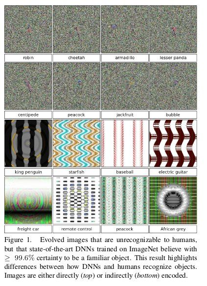
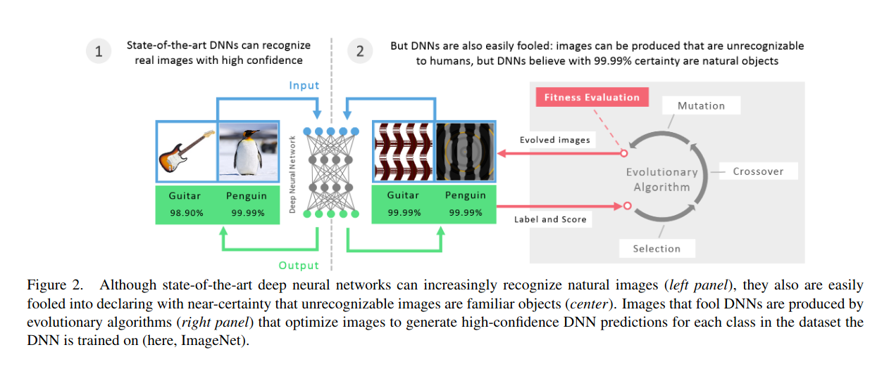

## Related Works
1. C. Szegedy, W. Zaremba, I. Sutskever, J. Bruna, D. Erhan,I. Goodfellow, and R. Fergus. Intriguing properties of neural networks. arXiv preprint arXiv:1312.6199, 2013.
  - Changing an image, originally correctly classified (e.g. as a lion), in a way imperceptible to human eyes, can cause a DNN to label the image as something else entirely (e.g. mislabeling a lion as a library).
  - For example, Changing a few pixels in an image of lion can mislead the DNN to classify it as a library. Though the altered image seems like a lion to human, the DNN recognises it as a library.
2. D. Floreano and C. Mattiussi. Bio-inspired artificial intelligence:  theories,  methods,  and  technologies.   MIT  press,2008.
  - IDK (Need to read it)
3. A. Cully, J. Clune, and J.-B. Mouret. Robots that can adapt like natural animals. arXiv preprint arXiv:1407.3501, 2014.
  - IDK (Need to read it)
4. K. Deb.Multi-objective optimization using evolutionary algorithms, volume 16. John Wiley & Sons, 2001.
  - IDK (Need to read it)
5. H. Lipson. Principles of modularity, regularity, and hierarchy for scalable systems.Journal of Biological Physics andChemistry, 7(4):125, 2007.
  - IDK (Need to read it)
6. K. O. Stanley.  Compositional pattern producing networks: A novel abstraction of development. Genetic programming and evolvable machines, 8(2):131–162, 2007
  - IDK (Need to read it)
7. . Secretan, N. Beato, D. B. D Ambrosio, A. Rodriguez,A. Campbell, and K. O. Stanley. Picbreeder: evolving pictures collaboratively online. In Proceedings of the SIGCHI Conference on Human Factors in Computing Systems, pages1759–1768. ACM, 2008.
  - IDK (Need to read it)
8. J. E. Auerbach.Automated evolution of interesting im-ages.  In Artificial Life 13, number EPFL-CONF-191282.MIT Press, 2012.
  - IDK (Need to read it)
9. ...

## Introduction
It is easy to produce images that are completely unrecognizable to humans (Fig. 1), but that state-of-the-art DNNs believe to be recognizable objects with over 99% confidence (e.g. labeling with certainty that TV static (refers to black and white dots screen on TV) is a motorcycle).

Figure 1

___

### Comparison with [1]
This differs from [1] in a sense that, in [1] they modified the pixels of a lion image (the image contained a legit object) and the network misclassified it as library. Whereas, in this paper, the authors take a **garbage image** i.e. image with black and white dots (no legit object), and the **model classifies it as a motorcycle**.

___

We use **evolutionary algorithms** or **gradient ascent** to generate images.

We also find that, for MNIST DNNs, **it is not easy to prevent the DNNs from being fooled** by retraining them with fooling images labeled as such. While retrained DNNs learn to classify the negative examples as fooling images, anew batch of fooling images can be produced that fool these new networks, even after many retraining iterations.

Here, the authors experimented with MNIST dataset. ~They added a new class 10 for garbage images.~ Prepared a dataset of such garbage images to train the network on it, with an expectation that these are garbage images and stop misclassifying them. As expected, the network learned patterns (after all that's what the ML models do) and stopped misclassifying such images as legit target classes. But now, running the algorithm (mentioned above) with this newly trained model, it generated new garbage images which the model will misclassify. Repeating these steps, it showed no good results.

In the above part, the authors did not add a new class. Instead, they expected the model to output low probability for each of the default classes. Thus the model effectively have a way to communicate "garbage" image. **The authors haven't yet tried adding a new "garbage" class.**

Also, the output probabilities of all classes must sum up to 1 i.e. the output activation function is softmax and not sigmoid.

### Topics discussed
1. Comparison between human vision and DNN-based computer vision
2. Performance of DNNs, in general, across different types of images than the ones they have been trained and traditionally tested on.

## Work

### Pre-trained models used
1. ImageNet DNN - AlexNet + ImageNet
2. MNIST DNN - LeNet + MNIST

### Generating images using evolutionary algorithm
EAs are optimization algorithms inspired by Darwinian evolution (the theory of evolution of humans -- from monkey to human). They contain a population of "organisms" (here, images) that alternately face **selection** (keeping the best) and then **random perturbation** (mutation and/or crossover). Which organisms are selected depends on the **fitness function**, which in these experiments is the highest prediction value a DNN makes for that image belonging to a class (Fig. 2).

To know more about these terms, visit the link of genetic algorithms provided in [For more information](#for-more-information) section of this file.

Figure 2

The EA mentioned in [2] optimize solutions to perform well on one objective or on a small set of objectives (e.g. evolving images to match a single ImageNet class).

So, we use a new algorithm called **the multi-dimensional archive of phenotypic elites MAP-Elites** [3], which enables us to simultaneously evolve a population that contains individuals that score well on many classes (e.g. all 1000 ImageNet classes).

**Fitness** is determined by showing the image to the DNN; if the image generates a higher prediction score (probability) **for any class** than has been seen before, the newly generated individual (image) becomes the champion in the archive **for that class**.

___

#### Representation of Images as genome (Image Encoding)
Two different types of encoding:
1. Direct Encoding
2. Indirect Encoding

**Direct Encoding**
- One grayscale integer for each of 28×28 pixels for MNIST, and three integers (H, S, V) for each of 256×256 pixels for ImageNet.
- Steps:
  1. Each pixel value is initialized with **uniform random noise** within the [0,255] range.
  2. Those numbers are independently mutated; first by determining which numbers are mutated, via a rate **(mutation rate)** that starts at 0.1 (each number has a 10% chance of being chosen to be mutated) and **drops by half every 1000 generations**.
  3. The numbers chosen to be mutated are then altered via the **polynomial mutation operator** [4] with a fixed **mutation strength of 15**.

___

## For more information
1. Official Website - http://www.evolvingai.org/fooling
2. Genetic/Evolutionary Algorithms - https://github.com/ParikhKadam/genetic-or-evolutionary-algorithms